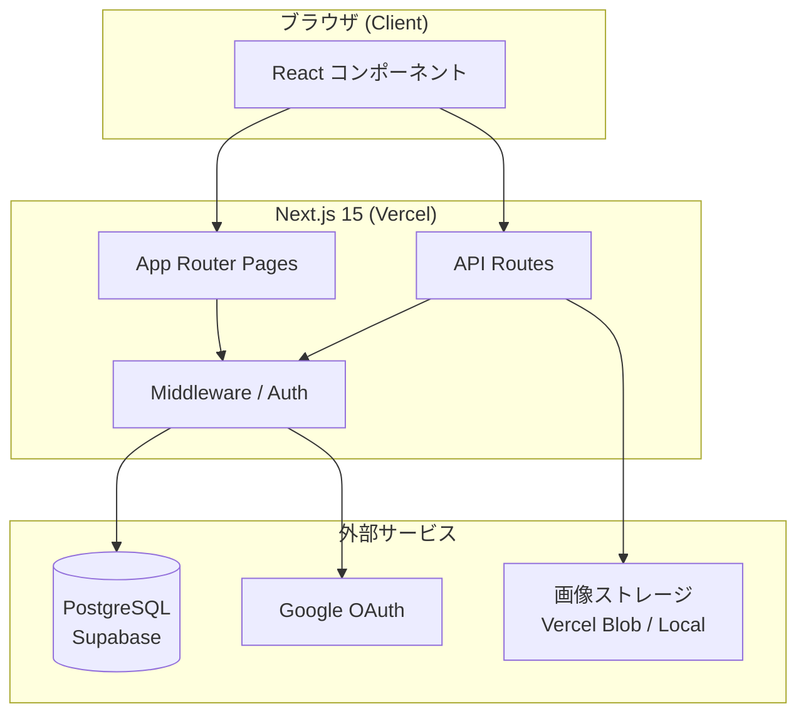
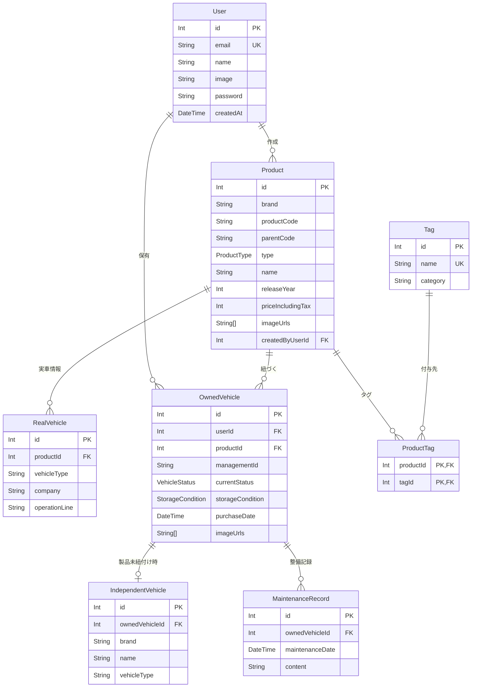
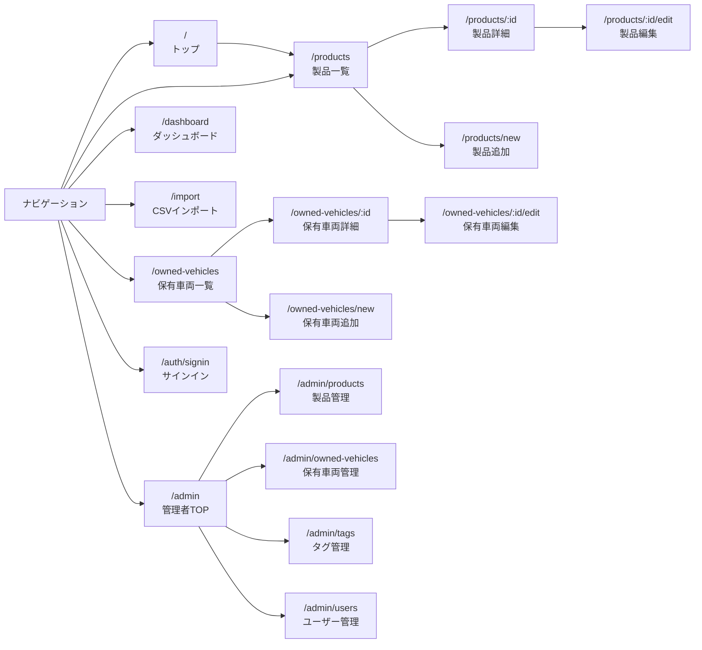
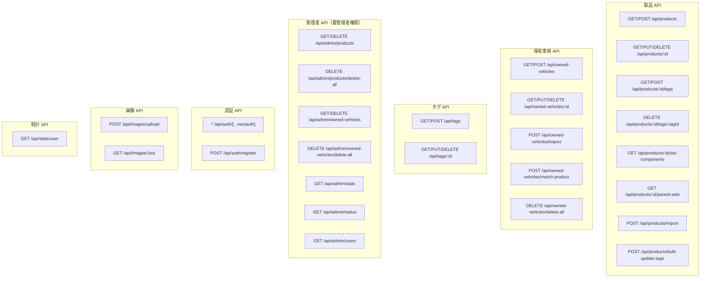
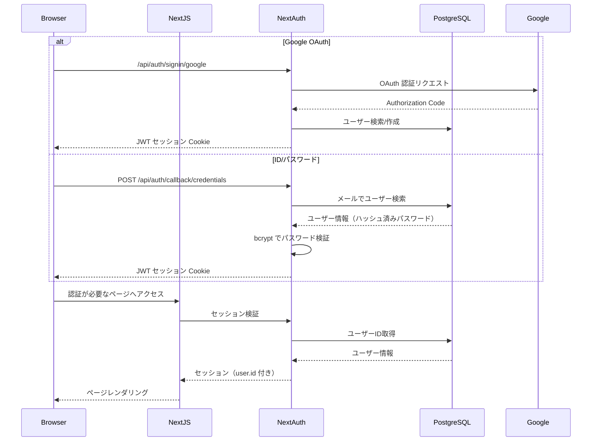
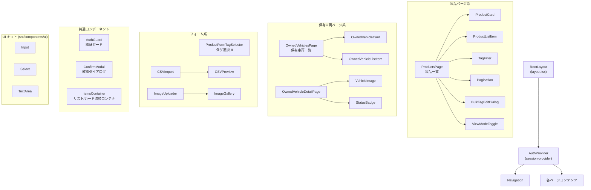
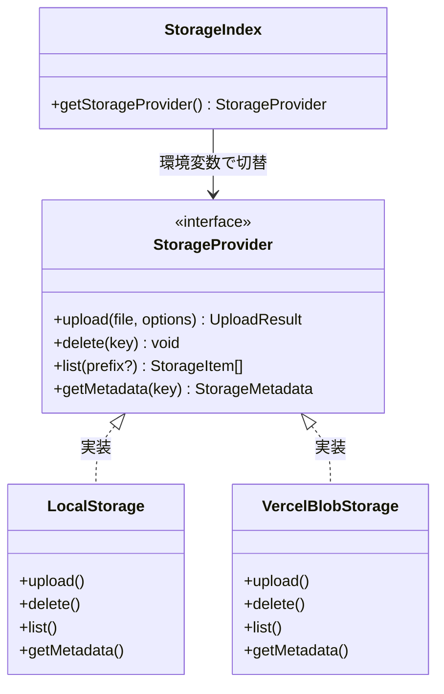
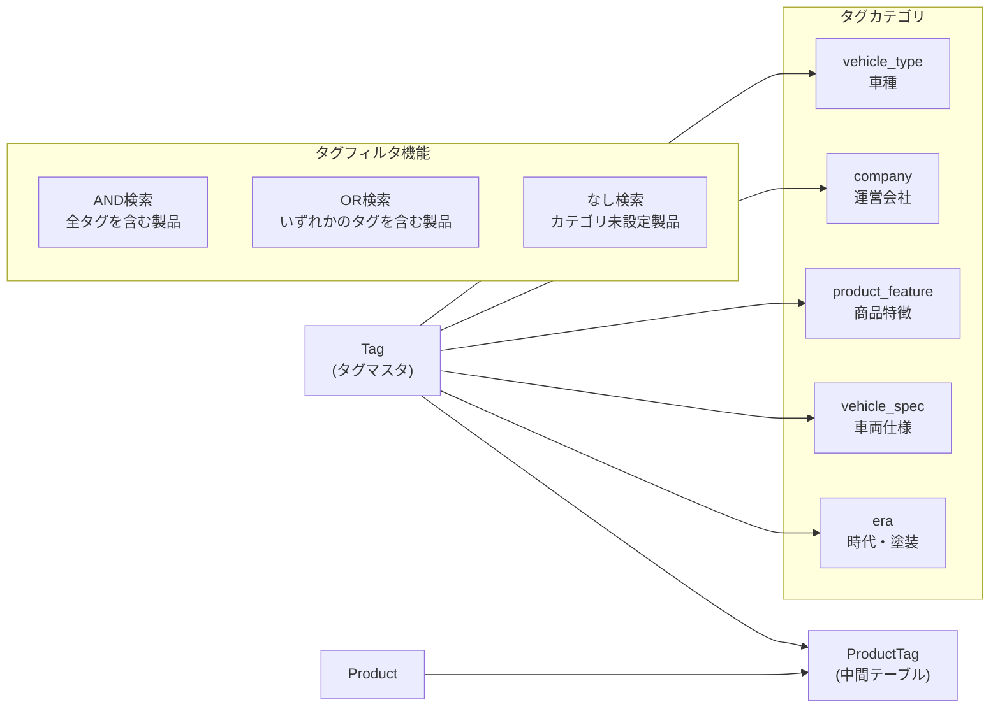
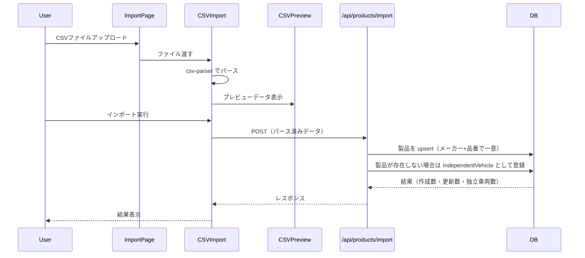

# apps/web-next ソフトウェア構造

Nゲージ鉄道模型管理アプリのフロントエンド/バックエンドを担う Next.js 15 アプリケーション。

---

## 全体アーキテクチャ



---

## ディレクトリ構造

```
src/
├── app/                    # Next.js App Router
│   ├── layout.tsx          # ルートレイアウト（Navigation + AuthProvider）
│   ├── page.tsx            # トップページ（製品一覧へリダイレクト）
│   ├── products/           # 製品情報 UI
│   ├── owned-vehicles/     # 保有車両 UI
│   ├── admin/              # 管理者専用画面
│   ├── import/             # CSVインポート画面
│   ├── auth/               # 認証画面
│   └── api/                # API Routes（バックエンド）
│       ├── auth/           # NextAuth.js エンドポイント
│       ├── products/       # 製品 CRUD + タグ + インポート
│       ├── owned-vehicles/ # 保有車両 CRUD + インポート
│       ├── tags/           # タグ CRUD
│       ├── admin/          # 管理者専用 API
│       ├── images/         # 画像アップロード/取得
│       └── stats/          # 統計情報
├── components/             # 共有 React コンポーネント
│   ├── ui/                 # 汎用 UI パーツ（Input, Select, TextArea）
│   ├── shared/             # 横断的コンポーネント（VehicleImage, StatusBadge）
│   ├── admin/              # 管理者専用コンポーネント
│   └── providers/          # Context プロバイダー（session-provider）
├── lib/                    # ユーティリティ・インフラ層
│   ├── prisma.ts           # Prisma クライアントシングルトン
│   ├── auth.ts             # NextAuth 設定
│   ├── admin-auth.ts       # 管理者権限チェック
│   ├── csv-parser.ts       # CSV パース処理
│   ├── storage/            # 画像ストレージ抽象化
│   ├── validations/        # Zod バリデーションスキーマ
│   └── utils/              # 汎用ユーティリティ
├── hooks/                  # カスタム React フック
│   ├── useAdmin.ts         # 管理者ステータス取得
│   └── useViewMode.ts      # 一覧/カード表示切替
├── constants/              # 定数定義
│   ├── tags.ts             # タグカテゴリ定数
│   ├── productTypes.ts     # 製品種別定数
│   └── vehicle.ts          # 車両ステータス定数
└── types/
    ├── domain.ts           # ドメイン型定義（Product, OwnedVehicle, Tag）
    └── next-auth.d.ts      # NextAuth セッション型拡張
```

---

## データモデル



### Enum 一覧

| Enum | 値 |
|------|-----|
| `ProductType` | `SINGLE`（単品）/ `SET`（セット）/ `SET_SINGLE`（セット単品） |
| `VehicleStatus` | `NORMAL`（正常）/ `NEEDS_REPAIR`（要修理）/ `BROKEN`（故障中） |
| `StorageCondition` | `WITH_CASE`（ケースあり）/ `WITHOUT_CASE`（ケースなし） |
| `PurchaseCondition` | `NEW`（新品）/ `USED`（中古） |

---

## 画面構成と遷移



---

## API Routes 構成



---

## 認証フロー



---

## コンポーネント構成



---

## ストレージ抽象化



`src/lib/storage/index.ts` が環境変数 `BLOB_READ_WRITE_TOKEN` の有無によって、本番（Vercel Blob）とローカル（ファイルシステム）を自動切替する。

---

## タグシステム

タグは5カテゴリに分類され、製品に多対多で紐づく。



---

## データフロー（CSVインポート）



---

## 技術スタック

| レイヤー | 技術 |
|---------|------|
| フレームワーク | Next.js 15 (App Router) |
| 言語 | TypeScript |
| スタイリング | Tailwind CSS |
| データベース | PostgreSQL (Supabase) |
| ORM | Prisma |
| 認証 | NextAuth.js (Google OAuth + Credentials) |
| パスワードハッシュ | bcryptjs |
| 画像ストレージ | Vercel Blob（本番）/ ローカルFS（開発） |
| テスト | Vitest + React Testing Library / Playwright (E2E) |
| デプロイ | Vercel |
